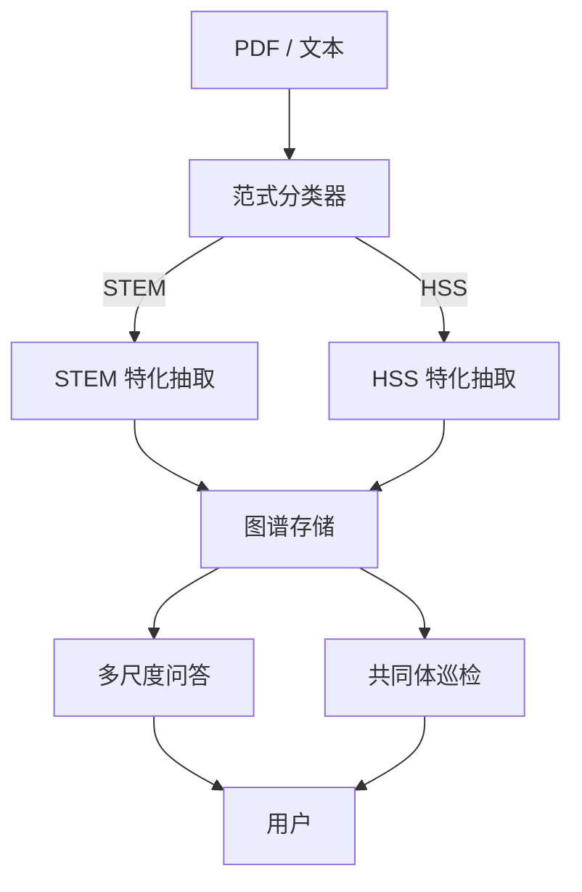
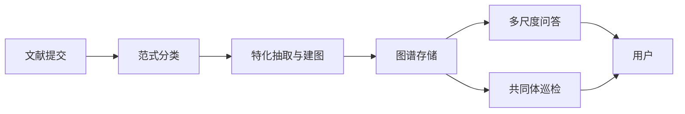

# ScholarGraph

**学术论文的逻辑解构与共同体发现 Agent**

> **核心创新**：在知识图谱层面兼容**人文社科（HSS）**与**理工科（STEM）**两套论文逻辑范式——前者强调「基于特定视角的脉络化论证」，后者强调「基于控制变量的量化实验验证」——通过**双模状态机 + 特化 Schema + 交叉对齐**，而非用单一 Prompt 强行覆盖所有学科。

---

## 摘要

ScholarGraph 是一个面向科研阅读的**学术研究助手型 Agent**：它能够将单篇论文自动解构为可查询、可追溯的**逻辑知识图谱**，支持从摘要到论证细节/实验条件的**多尺度问答**；在多篇论文的融合图谱之上，还能主动执行**共同体巡检**，探测跨论文的**矛盾、共识与研究空白**。

项目设计紧密贴合 **Agent 自主决策** 与 **GraphRAG** 的结合，并将「文理分家」在图谱层做**高层抽象对齐**，适合作为 AI Agent 训练营、课程大作业或科研中的系统原型与验证平台。

---

## 目录

- [背景与问题](#背景与问题)
- [范式差异：HSS 与 STEM](#范式差异hss-与-stem)
- [顶层架构：双模状态机驱动](#顶层架构双模状态机驱动)
- [核心能力](#核心能力)
- [HSS 特化抽取：Prompt 策略](#hss-特化抽取prompt-策略)
- [共同体巡检：双范式玩法](#共同体巡检双范式玩法)
- [系统流程](#系统流程)
- [与 Agent + GraphRAG 课题的契合性](#与-agent--graphrag-课题的契合性)
- [技术栈建议](#技术栈建议)
- [MVP 落地指南](#mvp-落地指南)
- [范围与假设](#范围与假设)

---

## 背景与问题

科研人员在文献工作中常面临三类困难：

1. **长文阅读成本高**：论文篇幅长、论证链复杂；STEM 需梳理「问题—方法—实验—结论」，HSS 更需梳理「谱系—分论点—理论视角—质性材料」等多层脉络，人工成本高且易遗漏。
2. **跨文对比困难**：多篇结论看似相关甚至相反，但 STEM 需对照**实验设定与指标**，HSS 需对照**理论框架与研究对象**是否可比，往往依赖大量人工对照。
3. **知识关联与空白难发现**：领域内隐含共识、学派分歧与材料覆盖空白，缺乏系统化支撑；纯向量检索难以稳定完成多跳、跨范式的推理。

ScholarGraph 的目标是用**结构化图谱 + 可规划 Agent**，把「读一篇」升级为「可查询的逻辑骨架」，把「读多篇」升级为「可推理的文献共同体视图」——并让人文社科论文的**论证逻辑**与理工科的**验证逻辑**在同一套工程架构下各得其所。

---

## 范式差异：HSS 与 STEM

| 维度 | STEM（理工科） | HSS（人文社科） |
|------|----------------|-----------------|
| 研究核心 | 基于控制变量的量化实验验证 | 基于特定视角的脉络化论证 |
| 典型节点 | 方法、数据集、指标、基线、声称、实验证据 | 学术谱系、核心论点、分论点、理论视角、研究对象/材料 |
| 典型关系 | 声称—证据、方法—数据集、优于/劣于基线 | 挑战既有观点、分论点支撑论点、材料经理论视角审视 |
| 跨文对比焦点 | 指标、设定、数据域是否可比 | 同一对象上不同理论框架的冲突、史料/材料类型的覆盖空白 |

**工程原则**：不要用一套 Prompt 搞定所有论文；在 LangGraph 中实现「分流 → 特化抽取 → 交叉对齐」。

---

## 顶层架构：双模状态机驱动

在 LangGraph 中设计**分流—特化抽取—交叉对齐**流水线，用状态机而非单体 Prompt 承载学科差异。

### 1. 范式分类器（Paradigm Classifier）

PDF 转为文本并完成 head refine 后，流水线进入分类节点。Live 模式下 **单次 LLM structured output**（`backend/prompts/classifier.md` → `ParadigmClassification`）；失败时降级 **关键词启发式**（`classifier_heuristic.py`），写入 `classify_warnings` 机器码 `classifier_heuristic_fallback`，流水线**不 failed**。

输出 JSON（内嵌于 `GET /papers/{id}` 的 `classification`，warnings 在并列字段 `classify_warnings`）：

```json
{
  "paradigm": "HSS",
  "confidence": 0.95,
  "reason": "本文使用了历史制度主义视角，考察近代中国通商口岸的制度演变，无显式数据集与量化指标，属于典型的人文社科规范。"
}
```

`paradigm` 取值为 `"HSS"` 或 `"STEM"`；`reason` 为 LLM 或规则层解释（与前端 fallback toast 文案分离）。

### 2. 特化抽取图谱（Specialized Extraction）

根据分类结果，状态机进入 STEM / HSS 分支。Live 模式下 **单次 LLM structured output**（`extract_stem.md` / `extract_hss.md` → `UnifiedPaperGraph`）；失败时降级 **启发式建图**（`extract_heuristic.py`），写入 `extract_warnings` 机器码 `extract_heuristic_fallback`。**分类与抽取独立**：分类 LLM 成功时抽取仍可能 fallback（schema 更大、耗时更长）。

- 挂载**不同的 Pydantic Schema**（统一的 `UnifiedPaperGraph` 外壳，内部分 STEM / HSS 子结构）；
- 注入**特化 Prompt 模板**；
- **Schema 约束**：若范式为 HSS，图谱中**不允许**出现 `Metric`、`Baseline` 等 STEM 专用节点类型，仅允许 `Analytical_Lens`、`Intellectual_Context` 等 HSS 类型（反之亦然，在 STEM 分支禁用 HSS 专有类型）。

### 3. 交叉对齐（Cross-paradigm Alignment，后续扩展）

多篇图谱入库后，在**共同体层**按「研究对象 / 核心问题」等锚点对齐，再执行范式特化的巡检算法（见下文）。



---

## 核心能力

### 1. 单篇解构：双范式逻辑图谱

用户提交论文后，Agent **规划并执行**分类 + 抽取 + 建图，将全文转化为**细粒度、可导航、可溯源**的知识图谱。

**STEM 图谱侧重**（示例维度）：

| 维度 | 说明 |
|------|------|
| 研究问题 | 核心问题与任务设定 |
| 方法 | 总体思路与主要模块/组件 |
| 实验 | 数据集、设定、指标与对比基线 |
| 声称 | 性能、适用条件等明确或隐含主张 |
| 证据 | 支持各声称的实验或理论依据 |

**HSS 图谱侧重**（示例维度）：

| 维度 | 说明 |
|------|------|
| Intellectual_Context | 作者批判、质疑或修正的既有观点、学者或流派 |
| Thesis / Sub-argument | 核心结论与 3–5 个支撑性分论点及其递进关系 |
| Analytical_Lens | 核心理论武器（如结构洞、差序格局） |
| Object_or_Data | 质性材料（访谈、档案、文本等） |
| 边类型示例 | `CHALLENGES`、`SUB_ARGUMENT_OF`、`EXAMINES_THROUGH` |

### 2. 多尺度阐释：基于图谱的问答

在同一张（或融合后的）图谱上，Agent 将自然语言问题**翻译为图谱遍历与检索**，再生成附带**节点/路径引用**的答案：

- **摘要尺度**：「这篇论文做了什么？」—— 围绕核心问题/论点与方法或理论视角生成总览。
- **细节尺度（STEM）**：「方法 X 的模块 B 如何设计？与基线有何不同？」
- **细节尺度（HSS）**：「分论点 2 如何支撑核心论点？与既有流派的关系是什么？」
- **验证尺度（STEM）**：「声称优于方法 Y 在何种实验与数据设定下成立？」
- **验证尺度（HSS）**：「核心论点通过哪些材料、经何种理论视角被论证？」

### 3. 共同体发现：从记忆到洞察

多篇图谱入库后，Agent **按需或按计划**运行共同体巡检，产出结构化洞察（范式不同，算法不同，见下一节）。

---

## HSS 特化抽取：Prompt 策略

人文社科论文篇幅长、论证盘根错节。HSS 抽取器 Prompt 须**强制**捕捉以下三类逻辑（可直接写入系统指令）：

### 1. 学术谱系与对立面（Intellectual Context）

社科论文极少凭空立论，作者常在「推翻」或「修正」某个既有流派。

> **Prompt 指令**：请找出作者在引言或文献综述中，明确批判、质疑或试图修正的传统观点、学者或学术流派（常伴随「然而」「过去的研究忽略了」等转折）。将其抽象为 `Intellectual_Context` 节点，并用 `CHALLENGES` 边指向该节点。

### 2. 论证树状递进（Sub-arguments Chain）

一个大论点（Thesis）往往由 3–4 个章节级分论点联合支撑。

> **Prompt 指令**：识别文章的核心结论（Thesis）。根据大标题或核心论证段落，拆解出支撑该结论的 3–5 个次级分论点（Sub-arguments），建立 `[Sub_Argument] --SUB_ARGUMENT_OF--> [Thesis]`，还原质性论证骨架。

### 3. 理论视角对材料的裁剪（Analytical Lens vs Object）

> **Prompt 指令**：找出作者赖以分析的核心理论武器（如「结构洞理论」「差序格局」），以及具体质性材料（如「某村落宗族访谈」「某晚清日记」）。建立 `[Object_or_Data] --EXAMINES_THROUGH--> [Analytical_Lens]`。

---

## 共同体巡检：双范式玩法

当库中积累多篇论文后，巡检逻辑须**随范式分化**；HSS 场景下「比指标谁高」往往失效，应启用下列人文社科特色算法（可作为答辩核心亮点）：

### STEM 向（经典 GraphRAG）

| 模式 | 说明 |
|------|------|
| 矛盾探测 | 相互冲突的声称（如 P1 称 A 优于 B，P2 称 B 优于 A），并对齐实验设定、数据域、指标是否可比 |
| 共识追踪 | 某论断在哪些论文、何种条件下被重复支持 |
| 空白发现 | 基于「方法—数据集—声称」覆盖矩阵，指出尚未被验证的组合 |

### HSS 向（升级玩法）

| 巡检模式 | 触发逻辑 | 产出洞察（示例） |
|----------|----------|------------------|
| **理论视角冲突（Lens Clash）** | 两篇论文的 **Object_or_Data** 高度重合，但 **Analytical_Lens** 不同 | *巡检报告：关于「网络社群极化」，论文 A 引入波德里亚「消费社会」视角，视为符号狂欢；论文 B 引入哈贝马斯「公共领域」理论，视为理性沟通失效。两者存在潜在学派冲突。* |
| **论据孤岛与空白（Archive Gap）** | 构建「核心论点 × 史料/材料类型」覆盖矩阵 | *巡检报告：关于「近代江南棉纺织业演变」的 5 篇文献中，4 篇采用「海关统计年报」作 Evidence，仅 1 篇采用「民间契约文书」。「核心论点 3」在口述史/民间档案层面仍属研究空白。* |

**演示目标**：在 Demo 中自动识别两篇社科论文「用不同理论讨论同一对象」，形成训练营级别的差异化展示。

---

## 系统流程

端到端流程概括为五个阶段：

1. **提交**：用户上传 PDF，或从已入库文献中选择目标论文。
2. **范式分类**：基于摘要与引言片段输出 `STEM` / `HSS` 及置信度。
3. **解构与入库**：走对应分支完成实体关系抽取，写入图存储（Schema 与节点类型受范式约束）。
4. **交互问答**：自然语言问题映射为图谱查询，返回可溯源回答。
5. **主动分析**：多篇基础上运行共同体巡检（含 Lens Clash、Archive Gap 等 HSS 模式）。



---

## 与 Agent + GraphRAG 课题的契合性

- **封闭域、可聚焦**：典型语料 20–30 篇，便于验证分类稳定性、HSS 抽取准确率与 Lens Clash 召回。
- **Agent 决策链完整**：从范式选择、抽取策略到何时触发共同体分析，均可由 Agent 自主或与用户协同决定。
- **GraphRAG 不可替代性**：跨论文的学派冲突、材料覆盖空白依赖**显式结构与多跳关系**，纯向量检索难以稳定完成。
- **创新点可答辩**：双轨制在图谱层对齐文理逻辑；Demo 跑通「两篇社科用不同理论吵架」即可形成鲜明差异。
- **可延展产出**：系统设计可整理为训练营报告、技术报告或论文 System / Demo 章节。

---

## 技术栈建议

| 层次 | 建议选项 | 说明 |
|------|----------|------|
| 图谱建模与存储 | NetworkX（原型）/ Neo4j 轻量部署 | 原型可用内存图；需持久化与复杂查询时再迁库 |
| Agent 编排 | LangGraph | 分流状态机、多步工具调用、检查点与可观测日志 |
| 结构化抽取 | Pydantic + 范式分 Schema | STEM / HSS 分支禁止越界节点类型 |
| 抽取与生成 | GPT-4o、Llama 3 等 + JSON Schema | 分类器、抽取器、问答均需强约束输出 |
| 前端与演示 | **Vue 3 + Vite + Pinia + Element Plus + AntV G6 v5**（主路径）；Gradio / Streamlit 仅作答辩备用 | 见 [docs/v1/tech-stack.md](docs/v1/tech-stack.md) |

具体版本与依赖以仓库根目录 **`pyproject.toml`** 与 **`uv.lock`** 为准（由 [uv](https://docs.astral.sh/uv/) 管理）。

### 本地运行

**终端 1 — 后端**（仓库根目录）：

```bash
uv sync
cp .env.example .env   # 默认 LLM_MODE=mock；接华为云时改为 live 并填 Key
uv sync --group dev
uv run python scripts/check_backend.py   # ruff lint + format-check + pytest（排除 red）
uv run python scripts/run_d_gates.py     # D-01～D-10 代码基座（含 FE npm run check，可 --skip-frontend）
uv run uvicorn backend.main:app --reload --host 127.0.0.1 --port 8000
```

**终端 2 — 前端**（`frontend/`）：

```bash
cd frontend
npm install
cp .env.development.example .env.development   # 推荐留空 VITE_API_BASE_URL，走 Vite /api 代理
npm run dev
```

- 前端：`http://localhost:5173`（`/api` 代理到 `http://127.0.0.1:8000`）
- 健康检查：`GET http://127.0.0.1:8000/api/v1/health`（含 `llm_mode` / `llm_connected`）
- Swagger：`http://127.0.0.1:8000/docs`
- 浏览器答辩路径：`uv run python scripts/run_frontend_demo.py`（详见 [docs/v1/eval/frontend-demo-path.md](docs/v1/eval/frontend-demo-path.md)）
- 新成员详见 [docs/v1/onboarding.md](docs/v1/onboarding.md)

合 **develop** / 答辩前可再跑：`uv run python scripts/run_v1_ac_gates.py`（`check:ci` + `run_qa`/`run_patrol` smoke）；E2E 见 `scripts/run_cp4_rehearsal.py`（24 步，需前后端已启动）。

分步（后端）：`uv run ruff check backend tests scripts`、`uv run ruff format --check backend tests scripts`、`uv run pytest -q -m "not red"`。

---

## MVP 落地指南

采用**最小可行产品迭代**，避免复杂架构一次性卡壳：

### 1. 选定「黄金测试微语料集」

- **1 篇 STEM**：熟悉的大模型 / Agent 框架类论文（便于对照指标与基线节点）。
- **1–2 篇 HSS**：**强烈建议**选就**同一社会热点或历史事件**展开争论的两篇社科论文（例如两篇探讨「AI 对零工经济中劳动者心理影响」的论文，一篇偏乐观、一篇偏批判），便于验证 Lens Clash。

### 2. 编写分类器 Prompt（第一步可今晚完成）

- Live 主路径：`backend/prompts/classifier.md` + `classifier_llm.py`（structured output）。
- 本地 / CI 无 Key：`LLM_MODE=mock` → `mock_classify`。
- 验收：微语料集上分类结果与人工标注一致；`pytest tests/eval/test_m0_classifier_gold.py -m red`（需 corpus PDF）。

### 3. 手工固化 Schema 与边类型

- 在代码中定义 `UnifiedPaperGraph`（或等价结构）及范式枚举。
- **HSS 分支**：禁止 `Metric`、`Baseline`；仅允许 `Analytical_Lens`、`Intellectual_Context` 等。
- **STEM 分支**：禁止 HSS 专有类型；保留实验—声称—证据链。

### 4. 纵向切片里程碑

| 阶段 | 交付物 |
|------|--------|
| M0 | 分类器脚本 + 微语料集 |
| M1 | 单篇 HSS / STEM 各 1 张图谱 JSON + 入库 |
| M2 | 单篇多尺度问答（带图谱引用） |
| M3 | 双文 Lens Clash 或 STEM 矛盾探测 Demo |
| M4 | LangGraph 全链路 + 可观测日志 |

### 5. 评测维度（建议）

- 范式分类准确率（摘要级）
- 单篇关键节点/边召回（与人工标注小样对比）
- 多文矛盾 / Lens Clash 召回与误报率
- 问答答案的路径引用是否可复核

---

## 实现状态（V1）

仓库已包含可运行的 **V1 纵向切片**（`develop` / `main` 合入后）：

| 能力 | 实现位置 | 说明 |
|------|----------|------|
| HTTP 基座 | `backend/api/routes/` | REST + SSE；前缀 `/api/v1` |
| PDF 摄入 | `backend/ingest/` | PyMuPDF 解析；`ingest_pdf()` 供 workflow 调用 |
| 范式分类 / 抽取 | `backend/agents/` | **LLM 主路径** + 启发式 fallback；`classifier_*` / `extract_*` 分层；`classify_warnings` / `extract_warnings` |
| 图谱存储 / 问答 | `backend/graph/` | JSON 持久化；`qa_stream()` SSE 事件 |
| 共同体巡检 | `backend/patrol/` | `lens_clash` / `contradiction` |
| LangGraph 流水线 | `backend/graph/workflow.py` | ingest → head refine → classify → extract → store |
| 前端工作台 | `frontend/` | 文献库、上传、详情轮询、G6 图谱、SSE 问答、巡检；fallback toast/alert |
| LLM | `backend/llm/` | `LLM_MODE=mock`（默认）或 `live`；`CLASSIFIER_*` / `EXTRACT_*` 独立开关 |

**操作文档**：[docs/v1/onboarding.md](docs/v1/onboarding.md)（环境）、[docs/v1/api-contract.md](docs/v1/api-contract.md)（契约）、[docs/v1/eval/frontend-demo-path.md](docs/v1/eval/frontend-demo-path.md)（答辩路径）。

---

## 范围与假设

- 论文 PDF 需具备**可解析文本**（扫描件需 OCR，可作为后续扩展）。
- 抽取与巡检结论定位为**假设性线索**，须结合原文人工终审；共同体报告应标明范式、节点类型与图谱路径以便复核。
- 跨范式语料库（同一库中 STEM 与 HSS 并存）时，共同体分析默认**先按范式分组**，再在组内或经对齐锚点做跨文推理。
- V1 **不含**用户登录、MinerU 全量解析、Neo4j 生产部署；详见 [docs/v1/README.md](docs/v1/README.md)「V1 不做」。

---
