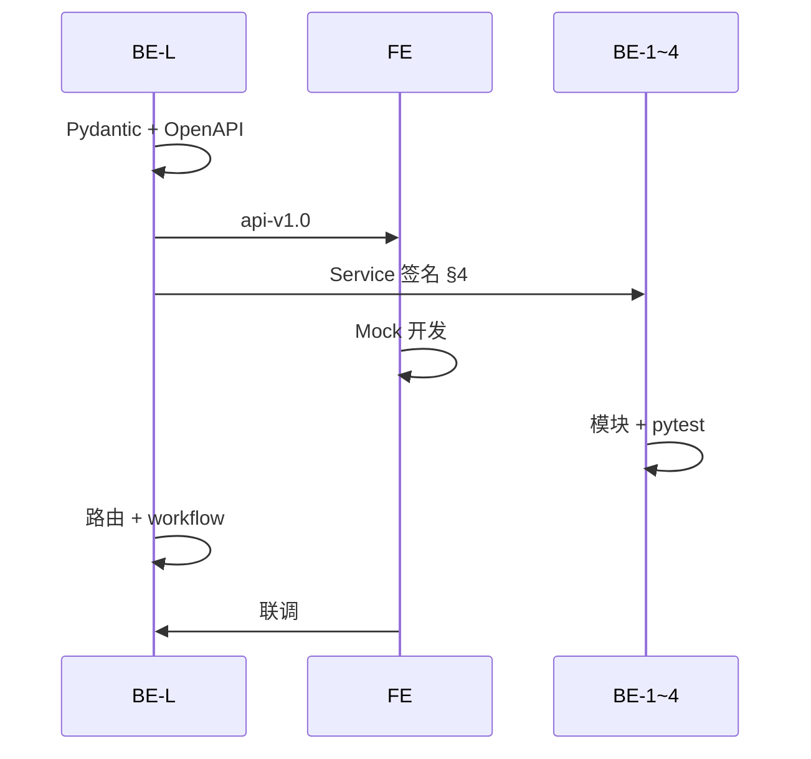

# V1 协作规范

> **分工**（谁做什么、分支、指标、排期）→ [任务分工](./work-assignment.md)  
> **技术栈**（Vue3、FastAPI、REST/SSE）→ [tech-stack.md](./tech-stack.md)  
> **目标**：模块 **解耦**、**可拼接**、契约 **可扩展**；冲突由 **BE-L** 裁定。

---

## 1. 分层与拼接规则

```text
FE（Vue3）           仅 HTTP / SSE
        ↓ OpenAPI
API 层（BE-L）       backend/api/routes/*.py
        ↓ Service 接口（§4）
Service 层           BE-1 ingest / BE-2 agent / BE-3 graph-qa / BE-4 patrol
        ↓ Pydantic
Domain（BE-2 主维护） backend/schemas/
Infra（BE-L）        llm / config / workflow
```

| 规则 | 说明 |
|------|------|
| R1 | FE 不得 `import backend`；BE 不得另起 FastAPI 实例 |
| R2 | API 层不写 Prompt；Agent 层不写 HTTP 细节 |
| R3 | 跨模块仅通过 **Schema + §4 Service + workflow** |
| R4 | 分支命名见 [任务分工 §3](./work-assignment.md#3-git-分支与-pr全员) |

---

## 2. 契约先行流程

| 步骤 | 负责人 | 产出 |
|------|--------|------|
| 1 | BE-L | Pydantic 模型 `backend/schemas/` |
| 2 | BE-L | `/docs`、`docs/api/openapi.yaml` |
| 3 | FE | `frontend/src/types/`（openapi-typescript 可选） |
| 4 | FE | `frontend/src/mocks/` 与 OpenAPI 一致 |
| 5 | BE-1～4 | Service 实现 + `tests/` |
| 6 | BE-L | 路由注册 + `workflow.py` |
| 7 | FE + BE-L | 联调（检查清单 §7） |

**版本**：对外接口冻结打 Git 标签 `api-v1.0`；破坏性变更须 **FE + 相关 BE** 会签，递增 `api-v1.1`。



---

## 3. 对外 HTTP API（V1.0）

- **前缀**：`/api/v1`（BE-L 在 `main.py` 挂载）
- **开发**：Vite `http://localhost:5173` ↔ FastAPI `http://localhost:8000`；BE-L 配置 **CORS**
- **纲要**：[`docs/api/openapi-v1-stub.yaml`](../api/openapi-v1-stub.yaml)

### 3.1 通用响应

**成功**：

```json
{ "data": { }, "meta": { "request_id": "uuid" } }
```

**失败**：

```json
{ "error": { "code": "LLM_JSON_INVALID", "message": "…", "details": {} } }
```

| code | HTTP | 场景 |
|------|------|------|
| `VALIDATION_ERROR` | 422 | 参数错误 |
| `PAPER_NOT_FOUND` | 404 | 无 paper_id |
| `INGEST_FAILED` | 400 | PDF 失败 |
| `GRAPH_NOT_READY` | 409 | 建图未完成 |
| `LLM_JSON_INVALID` | 502 | 模型 JSON 非法 |
| `LLM_TIMEOUT` | 504 | 超时 |

### 3.2 REST 端点

| 方法 | 路径 | 主责 Service | 说明 |
|------|------|--------------|------|
| GET | `/health` | BE-L | 健康检查 |
| GET | `/papers` | BE-L | 列表 `?paradigm=&status=` |
| POST | `/papers` | BE-L → workflow | `multipart` 字段 `file`；返回 `paper_id` |
| GET | `/papers/{id}` | BE-L | 元数据 + classification |
| GET | `/papers/{id}/status` | BE-L | **长轮询**进度 |
| GET | `/papers/{id}/graph` | BE-3 | G6 `nodes` / `edges` |
| POST | `/patrol` | BE-4 | `paper_ids` + `mode` |

**`GET /papers/{id}/status` 的 `stage`**（workflow 写入，禁止私增）：

| stage | percent | 模块 |
|-------|---------|------|
| `ingesting` | 10–20 | BE-1 |
| `classifying` | 30–50 | BE-2 |
| `extracting` | 60–80 | BE-2 |
| `storing` | 85–95 | BE-3 |
| `ready` | 100 | — |
| `failed` | — | — |

**`GET /papers/{id}/graph`**（BE-3 `to_g6()`）：

```json
{
  "data": {
    "paper_id": "hss-001",
    "paradigm": "HSS",
    "nodes": [{ "id": "n1", "label": "核心论点", "type": "Thesis", "data": {} }],
    "edges": [{ "id": "e1", "source": "n2", "target": "n1", "label": "SUB_ARGUMENT_OF", "type": "SUB_ARGUMENT_OF" }]
  }
}
```

字段与 `UnifiedPaperGraph` 一致；**禁止 FE 二次映射** `id`/`label`。

**`POST /patrol`**：body `{ "paper_ids": [], "mode": "lens_clash" | "contradiction" }`；响应含 `insights[]`（含 `node_refs`）。

### 3.3 SSE — 多尺度问答

由 **BE-L** 暴露路由，**BE-3** 实现 `qa_stream()`。

- 路径（BE-L 实现后冻结其一）：  
  `GET /papers/{id}/qa/stream?question=` 或 `POST` + body `{ "question" }`
- `Content-Type: text/event-stream`

| event | data | 说明 |
|-------|------|------|
| `message` | `{"delta":"…"}` | 文本增量 |
| `citation` | `{"node_id","label"}` | 图谱引用 → FE 高亮 G6 |
| `done` | `{"answer_id"}` | 结束 |
| `error` | `{"code","message"}` | 失败 |

---

## 4. 对内 Service 接口（拼接契约）

**workflow 与 API 只调用下表入口**；实现位置可放在各包或 `backend/services/`。

### 4.1 BE-1 — ingest

```python
class IngestResult(TypedDict):
    paper_id: str
    full_text: str
    classifier_input: str

async def ingest_pdf(file_path: Path, paper_id: str | None = None) -> IngestResult: ...
```

### 4.2 BE-2 — agent

```python
async def classify(classifier_input: str) -> ParadigmClassification: ...
async def extract(full_text: str, paradigm: Paradigm) -> UnifiedPaperGraph: ...
```

### 4.3 BE-3 — graph-qa

```python
class GraphStore:
    async def save(self, paper_id: str, graph: UnifiedPaperGraph) -> None: ...
    async def load(self, paper_id: str) -> UnifiedPaperGraph: ...
    def to_g6(self, graph: UnifiedPaperGraph) -> dict: ...

class GraphQuery:
    def subgraph_for_question(self, graph: UnifiedPaperGraph, question: str) -> dict: ...

async def qa_stream(paper_id: str, question: str) -> AsyncIterator[QaEvent]: ...
```

### 4.4 BE-4 — patrol

```python
async def run_patrol(paper_ids: list[str], mode: PatrolMode) -> PatrolReport: ...
```

### 4.5 BE-L — workflow

```python
async def run_paper_pipeline(paper_id: str, pdf_path: Path) -> None:
    """ingest → classify → extract → store；更新 status。"""
```

### 4.6 任务 ID → 模块映射

| 任务段 | Service 入口 | 主责 |
|--------|--------------|------|
| P1 | `ingest_pdf` | BE-1 |
| P2 | `classify` | BE-2 |
| P3 抽取 | `extract` | BE-2 |
| P3 存储 | `GraphStore.save` | BE-3 |
| P4 | `qa_stream` | BE-3 |
| P5 | `run_patrol` | BE-4 |
| P6 | `run_paper_pipeline` | BE-L |

---

## 5. 目录写权限

| 路径 | 主责 | 他人 |
|------|------|------|
| `frontend/**` | FE | 只读 |
| `backend/api/**`、`main.py`、`llm/**`、`config.py` | BE-L | 业务通过 router 注册 |
| `backend/ingest/**` | BE-1 | — |
| `backend/schemas/graph.py`、`paradigm.py`、`validators.py` | BE-2 | BE-3/4 只读；RFC |
| `backend/schemas/patrol.py` | BE-4 | BE-L Review |
| `backend/agents/classifier.py`、`extractor.py` | BE-2 | — |
| `backend/agents/qa.py` | BE-3 | — |
| `backend/graph/store.py`、`query.py` | BE-3 | BE-4 只读 store |
| `backend/patrol/**` | BE-4 | — |
| `backend/graph/workflow.py` | BE-L | 只调 Service，不内联业务 |
| `docs/api/**` | BE-L | 全员只读 |
| `tests/integration/**` | BE-L | 各模块自有 `tests/{模块}/` |

---

## 6. Schema 变更（RFC）

| 文件 | 主责 | 会签 |
|------|------|------|
| `schemas/paradigm.py` | BE-2 | BE-L, FE |
| `schemas/graph.py` | BE-2 | BE-L, BE-3, BE-4, FE |
| `schemas/patrol.py` | BE-4 | BE-L, FE |
| `schemas/paper.py`（若增） | BE-L | 全员 |

Issue 标题：`[Schema RFC] 简述` — 含动机、字段 diff、对 G6/OpenAPI 影响、迁移方案。

---

## 7. 前端对接规范

| 项 | 约定 |
|----|------|
| Base URL | `VITE_API_BASE_URL`，默认 `http://localhost:8000` |
| 路径 | `/api/v1/...` |
| 认证 | V1 无；禁止浏览器持有 LLM Key |
| 上传 | `FormData`，字段 `file` |
| 轮询 | 2s 间隔，最长 10min，`ready`/`failed` 停止 |
| SSE | `useQaStream` + `AbortController` |
| 类型 | 优先 `openapi-typescript` |

**联调 PR 检查清单**：

- [ ] Mock 与 OpenAPI 无字段 diff
- [ ] 上传 → status → graph 通
- [ ] SSE 收到 `done`
- [ ] citation 点击定位 G6 节点

---

## 8. 测试与沟通

| 类型 | 负责人 | 要求 |
|------|--------|------|
| 单元测试 | 各 BE / FE | pytest / vitest；LLM Mock |
| 集成测试 | BE-L | `tests/integration/` |
| FE 构建 | FE | `npm run build` |

| 事项 | SLA |
|------|-----|
| `[API RFC]` / `[Schema RFC]` | BE-L 2 工作日内 |
| 联调阻塞 | 当日 @BE-L |
| 周会 | 30min，过 [任务看板](./work-assignment.md#6-任务看板) |

**合并冲突**：`schemas/` → BE-2；`api/` → BE-L；`frontend/` → FE。

---

## 9. 可扩展性（V2 预留）

| 扩展 | 做法 |
|------|------|
| 新节点类型 | 扩展 `graph.py` + BE-2 Prompt；`to_g6()` 同步 |
| 新巡检模式 | `PatrolMode` + `patrol/` 新策略类 |
| 任务队列 | 替换 status 后端；Service 签名不变 |
| 用户系统 | API 中间件 JWT；Service 无感 |
| Neo4j | 新 `GraphStore` 实现 |

---

## 10. 相关文档

- [任务分工](./work-assignment.md)
- [技术栈](./tech-stack.md)
- [API 目录](../api/README.md)
- [V1 范围](./README.md)
