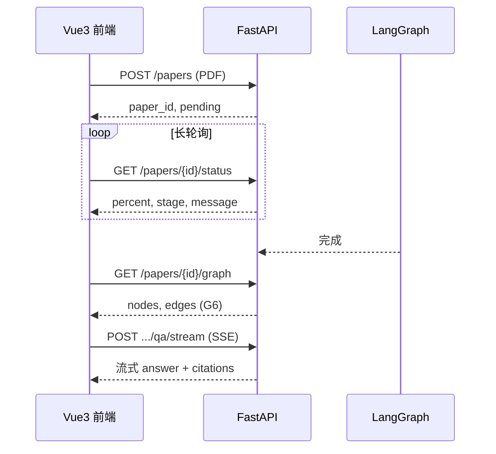

# V1 技术栈与前后端协作约定

> **团队既定选型**：**Vue 3 + Vite（前端）** 与 **Python + FastAPI + uv（后端）**。本文档为权威参考，实现与 Code Review 均以此为准。

---

## 为什么 Vue 3 + Python

### 前端：Vue 3 适合「学术工作台」型 AI 应用

- **Composition API + Pinia**：同时承载 PDF 上传预览、逻辑拓扑图、多尺度问答、巡检报告等模块，按功能解耦，避免单文件膨胀。
- **图可视化生态成熟**：**AntV G6 (v5)** 与 Vue 3 集成顺畅，适合展示 HSS/STEM 双轨图谱（研究问题 → 理论视角/方法 → 论点/声称 → 材料/证据），支持拖拽、缩放、邻接高亮。

### 后端：Python 契合 Agent 与图结构

- **LangGraph、NetworkX、Pydantic** 等以 Python 为一等公民；后端统一在 `backend/` 用 **uv** 管理依赖。
- **FastAPI**：原生 **async/await**，适合 LLM 长耗时与流式输出；自带 **Swagger UI**（`/docs`），降低前后端沟通成本。

---

## 具体选型

### 前端（`frontend/`）

| 类别 | 选型 | 说明 |
|------|------|------|
| 框架 | **Vue 3** | Composition API |
| 构建 | **Vite** | 开发服务器默认 `http://localhost:5173` |
| 状态 | **Pinia** | 论文列表、当前 `paper_id`、任务进度、问答会话等 |
| UI 组件库 | **Element Plus** | 表格、抽屉、步骤条、上传等「工作台」组件（V1 已采用） |
| 图谱渲染 | **AntV G6 v5** | 知识图谱主视图；节点点击与 QA 引用联动 |
| HTTP 客户端 | **axios** 或 `fetch` 封装 | 统一 baseURL、错误处理 |
| 类型（可选） | `openapi-typescript` | 由后端 OpenAPI 生成 TS 类型 |

**不推荐 V1 使用**：React 栈、Webpack 脚手架、与用户系统绑定的重型后台模板。

### 后端（仓库根 + `backend/`）

| 类别 | 选型 | 说明 |
|------|------|------|
| 语言 | **Python 3.11+** | |
| 包管理 | **uv** | `uv sync`、`uv run`；见 [AGENTS.md](../../AGENTS.md) |
| Web 框架 | **FastAPI** | 异步路由、Pydantic 校验、自动 OpenAPI |
| Agent 编排 | **LangGraph** | ingest → head refine → **LLM 分类** → **LLM 抽取** → 存储 |
| 图算法（原型） | **NetworkX** | 复杂持久化前够用 |
| 图谱存储 V1 | JSON 文件 / SQLite | 见 `GRAPH_DATA_DIR`、`DATABASE_URL` |
| LLM | OpenAI 兼容 API | 统一 `backend/llm/client.py` |

**不推荐 V1 使用**：Flask（无原生 async 体验）、Django 全栈（过重）、后端直接承担页面渲染。

---

## 前后端交互模式

针对 ScholarGraph，约定三种通道（由负责人 **L** 在基座中统一实现）：

### 1. RESTful HTTP（常规）

用于短请求、可一次返回完整 JSON 的场景：

| 场景 | 方法 | 示例路径 |
|------|------|----------|
| 健康检查 | GET | `/api/v1/health`（含 `llm_mode` / `llm_connected`） |
| 文献列表 | GET | `/papers` |
| 上传 PDF | POST | `/papers`（`multipart/form-data`） |
| 论文元数据 / 范式 | GET | `/papers/{paper_id}`（含内嵌 `classification`） |
| 图谱数据 | GET | `/papers/{id}/graph` |
| 触发巡检 | POST | `/patrol` |

图谱 **Nodes/Edges** 字段名与 Pydantic Schema **一致**（如 `id`、`label`、`type`、`source`/`target`），禁止前后端各起一名。

### 2. SSE — Server-Sent Events（多尺度问答）

- **用途**：**`POST /api/v1/papers/{paper_id}/qa/stream`** + JSON `{"question"}` 流式返回（V1 已冻结，不用 GET）。
- **体验**：前端逐字/逐段渲染，避免 30s 白屏。
- **约定**：`message` / `citation` / `done` / `error` 四类 SSE 事件。
- **FE 实现**：`@microsoft/fetch-event-source`（见 [api-contract.md](./api-contract.md)）。

### 3. 任务进度 — 长轮询（V1 默认）/ WebSocket（可选）

- **用途**：单篇「PDF 解析 → 分类 → 抽取 → 建图」约 1–2 分钟。
- **流程**：
  1. `POST /papers` 立即返回 `{ "paper_id", "status": "pending" }`，后台 `asyncio.create_task(run_paper_pipeline(...))`
  2. FE 轮询 `GET /papers/{id}/status`，阶段与进度百分比（实现见 `backend/graph/state.py` `STAGE_PERCENT`）：

     | `stage` | `percent` | 典型 `message` |
     |---------|-----------|----------------|
     | `ingesting` | 20 | 正在解析 PDF |
     | `head_refining` | 35 | 文档头部精炼 |
     | `classifying` | 50 | 正在范式分类 |
     | `extracting` | 80 | 正在抽取逻辑图谱 |
     | `storing` | 95 | 正在写入图谱存储 |
     | `ready` | 100 | 建图完成 |
     | `failed` | 0 | 流水线失败（含 `error_code` / `failed_during`） |

  3. `status=ready` 或 `status=ready_with_warnings` 后 `GET /papers/{id}/graph` 拉取 G6 数据；`ready_with_warnings` 表示图谱可用但质量门控触发，前端建议渲染黄色警示边框
  4. 若 LLM 降级，轮询响应含 **`classify_warnings`** / **`extract_warnings`**（机器码）；前端映射为 toast / alert（见 [api-contract.md §1.1](./api-contract.md#11-降级警告字段classify_warnings--extract_warnings)）
- **WebSocket**：人力充裕时可由 L 增加 `WS /papers/{id}/progress`；V1 不强制。



---

## 开发环境与跨域

| 服务 | 默认地址 |
|------|----------|
| Vue (Vite) | `http://localhost:5173` |
| FastAPI | `http://localhost:8000` |
| API 文档 | `http://localhost:8000/docs` |

**CORS（L 负责）**：FastAPI 配置 `CORSMiddleware`，允许前端源（含 `5173`）及必要 Header。  
**Vite 代理（推荐）**：`frontend/vite.config.ts` 将 `/api` → `http://127.0.0.1:8000`；此时 `VITE_API_BASE_URL` **留空**，axios / SSE 使用相对路径 `/api/v1`。生产环境再配置完整 `VITE_API_BASE_URL`。

```python
# 基座示例（backend/main.py）
app.add_middleware(
    CORSMiddleware,
    allow_origins=["http://localhost:5173", "http://127.0.0.1:5173"],
    allow_credentials=True,
    allow_methods=["*"],
    allow_headers=["*"],
)
```

---

## 接口契约先行（避坑）

1. **先文档后编码**：W1 由 L 提供 OpenAPI（`/docs` 或 `docs/api/openapi.yaml`），FE 用 Mock 并行开发。
2. **图谱 JSON 与 `UnifiedPaperGraph` 对齐**：后端 Pydantic 序列化即前端 G6 的 `data`；改 Schema 必须同步 FE 类型与 Mock。
3. **禁止 FE 直调 LLM**：所有模型调用经 FastAPI；密钥仅在服务端 `.env`。
4. **统一错误体**：例如 `{ "code": "LLM_TIMEOUT", "message": "..." }`，便于 Ant Design Vue 的 `message.error`。
5. **不做用户系统 V1**：无 JWT/登录；若需防滥用，仅考虑可选 `X-Api-Key`（课后迭代）。

---

## 目录约定

```text
ScholarGraph/
├── backend/          # FastAPI + Agent（uv）
├── frontend/         # Vue 3 + Vite（npm）
├── docs/
│   ├── api/          # OpenAPI 导出、契约说明（L 维护）
│   └── v1/
│       └── tech-stack.md   # 本文档
├── pyproject.toml
└── uv.lock
```

---

## 与分工文档的对应

| 角色 | 技术栈相关职责 |
|------|----------------|
| **BE-L** | FastAPI 基座、CORS、OpenAPI、SSE 端点、任务 status 路由、LangGraph |
| **FE** | Vue3 + Pinia + G6 + UI 库 + SSE/轮询对接 |
| **BE-1～4** | 仅实现 `backend/` 业务模块，不新建第二套 HTTP 服务 |

---

## 相关文档

- [任务分工](./work-assignment.md)
- [协作规范](./collaboration.md)
- [API 契约详表](./api-contract.md)
- [开发规范](../../AGENTS.md)
