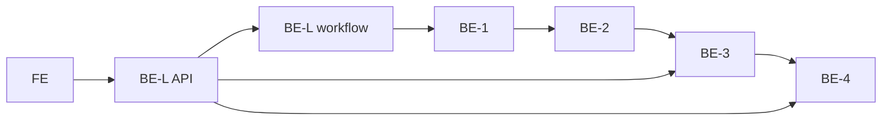

# V1 任务分工

> **团队**：6 人 = **1 前端（FE）** + **5 后端（BE-L、BE-1～BE-4）**  
> **产品**：[Vue 3 + FastAPI](./tech-stack.md) 学术工作台；**无用户系统**  
> **协作方式**（接口、Service、RFC、联调）→ 见 [协作规范](./collaboration.md)  
> **版本范围** → 见 [V1 README](./README.md)

---

## 1. 角色与依赖总览

| 代号 | 角色 | 主目录 | 分支前缀 |
|------|------|--------|----------|
| **FE** | 前端 | `frontend/` | `feature/frontend/{简述}` |
| **BE-L** | 后端负责人 · 基座与编排 | `backend/api/`、`llm/`、`graph/workflow.py`、`docs/api/` | `feature/backend/platform/{简述}` |
| **BE-1** | 后端 · 摄入 | `backend/ingest/` | `feature/backend/ingest/{简述}` |
| **BE-2** | 后端 · Agent | `backend/schemas/`、`backend/agents/`（分类/抽取）、`backend/prompts/` | `feature/backend/agent/{简述}` |
| **BE-3** | 后端 · 图谱与问答 | `backend/graph/`、`backend/agents/qa.py` | `feature/backend/graph-qa/{简述}` |
| **BE-4** | 后端 · 巡检 | `backend/patrol/`、`backend/schemas/patrol.py` | `feature/backend/patrol/{简述}` |



**阶段依赖**：`P0(BE-L)` → `P1(BE-1)` → `P2～P3(BE-2)` → `P3-5/P4(BE-3)` ∥ `P5(BE-4)` → `P6(BE-L)`；**FE** 自 W1 起 Mock 并行，W6 全链路联调。

---

## 2. 阶段路线（P0～P6）与主责

与 [产品 README M0～M4](../../README.md#纵向切片里程碑) 对齐。

| 阶段 | 里程碑 | 主责 | 周期建议 |
|------|--------|------|----------|
| **P0** | 工程基座 | BE-L | W1 |
| **P1** | 微语料 + PDF 管线 | BE-1 | W1～W2 |
| **P2** | 范式分类器 M0 | BE-2 | W2 |
| **P3** | Schema + 单篇抽取 M1 | BE-2（抽取）、BE-3（P3-5 存图） | W2～W4 |
| **P4** | 多尺度问答 M2 | BE-3 | W4～W5 |
| **P5** | 双文巡检 M3 | BE-4 | W4～W5（与 P4 并行） |
| **P6** | LangGraph 全链路 M4 | BE-L | W5～W6 |
| **FE** | 六页工作台 + 联调 | FE | W1～W6 |

### P0 — 工程初始化（BE-L）

| ID | 任务 | 验收 |
|----|------|------|
| P0-1 | `pyproject.toml` + `uv.lock` | `uv sync` 成功 |
| P0-2 | `backend/`、`tests/`、`scripts/` 骨架 | 符合 AGENTS.md |
| P0-3 | `backend/config.py` | 缺 Key 明确报错 |
| P0-4 | `backend/llm/client.py` | 统一 LLM 入口 |
| P0-5 | FastAPI `GET /api/v1/health` + CORS | `uvicorn` 可访问 |
| P0-6 | `tests/test_health.py` | `uv run pytest` 绿 |
| P0-7 | 根 README 运行说明 | 新人 15min 跑通 |
| BEL-6 | OpenAPI / `docs/api/openapi.yaml` | 见 [协作规范 §3](./collaboration.md#3-对外-http-api-v10) |

### P1 — 微语料与 PDF（BE-1）

| ID | 任务 | 验收 |
|----|------|------|
| P1-1～P1-2 | `corpus.md` + PDF 就位 | 1 STEM + 2 HSS |
| P1-3 | `backend/ingest/pdf.py` | UTF-8 正文 |
| P1-4 | `scripts/extract_text.py` | 可重复执行 |
| P1-5 | 分类器输入切片 | 供 P2 使用 |

### P2 — 范式分类 M0（BE-2）

| ID | 任务 | 验收 |
|----|------|------|
| P2-1～P2-3 | Schema + Prompt + `classifier.py` | JSON 稳定 |
| P2-4～P2-6 | 脚本 + 评测 | **3/3** 与 `classifier_labels.csv` 一致 |

### P3 — 抽取与存图 M1（BE-2 + BE-3）

| ID | 任务 | 主责 | 验收 |
|----|------|------|------|
| P3-1～P3-4、P3-8 | Schema + 抽取器 | BE-2 | Pydantic 校验通过 |
| P3-5 | `graph/store.py` | BE-3 | 按 `paper_id` 读写 |
| P3-6～P3-7 | 脚本 + gold 小样 | BE-2/全员 | 各范式 1 份图谱 JSON |

### P4 — 问答 M2（BE-3）

| ID | 任务 | 验收 |
|----|------|------|
| P4-1 | `graph/query.py` | 多跳查询 |
| P4-2～P4-5 | `qa.py` + Prompt + 测试 | 回答含 **citation**；供 BE-L SSE |

### P5 — 巡检 M3（BE-4）

| ID | 任务 | 验收 |
|----|------|------|
| P5-1～P5-6 | Lens Clash + 报告 + 评测 | ≥1 条可演示洞察 |

### P6 — 编排 M4（BE-L）

| ID | 任务 | 验收 |
|----|------|------|
| P6-1～P6-5 | workflow + `run_pipeline.py` | 单篇 PDF 端到端 |
| P6-7 | 集成测试 Mock | 不依赖真实 API |
| BEL-2～5 | papers/status/SSE/patrol 路由壳 | 调用各 Service |

---

## 3. Git 分支与 PR（全员）

### 3.1 长期分支

| 分支 | 用途 | 合入权限 |
|------|------|----------|
| `main` | 答辩基线 | BE-L |
| `develop` | 日常集成（建议） | BE-L Review 后 |
| `feature/project-init` | 初始化（将废弃） | — |

### 3.2 命名格式（统一）

```text
feature/frontend/{简述}
feature/backend/{工作类型}/{简述}

fix/frontend/{简述}
fix/backend/{工作类型}/{简述}
docs/、test/ 同上
```

| `{工作类型}` | 角色 |
|--------------|------|
| `platform` | BE-L |
| `ingest` | BE-1 |
| `agent` | BE-2 |
| `graph-qa` | BE-3 |
| `patrol` | BE-4 |

**禁止**：`feature/be1/`、`feature/agent/`（缺 `backend/`）、直接向 `main` push。

**Commit scope**：`frontend` 或 `platform` / `ingest` / `agent` / `graph-qa` / `patrol`。

### 3.3 PR 流程

1. 从 `develop` 拉分支 → 开发 → `uv run pytest` / `npm run build`
2. PR 描述：**任务 ID**、自测命令、**是否改契约**（改则 @FE + 相关 BE）
3. **必审**：BE-L；改 `schemas/` 或 HTTP → 额外会签
4. 里程碑由 BE-L 将 `develop` 合入 `main`（CP0～CP4）

---

## 4. 按角色：边界 · 任务 · 指标 · 分支

### 4.1 FE — 前端

| ✅ 负责 | ❌ 不负责 |
|---------|-----------|
| `frontend/` 全部、Pinia、G6、REST/SSE/轮询 | 后端、Prompt、LLM Key、用户系统 |

| 任务 ID | 内容 |
|---------|------|
| FE-1～FE-2 | UI 库锁定、线框/视觉 |
| FE-3～FE-4 | Vite 脚手架、`src/api/` |
| FE-5～FE-10 | 六页：文献库、上传、详情、图谱、问答、巡检 |
| FE-11 | 联调与答辩脚本 |

| 指标 | 目标 |
|------|------|
| 页面 | 六主屏可访问 |
| 契约 | 与 OpenAPI 一致，无未定义字段 |
| 进度 | 上传 3s 内出进度条，轮询 2s |
| 问答 | SSE 首 token ≤5s；citation 可点选高亮节点 |

| 周 | 分支示例 |
|----|----------|
| W1 | `feature/frontend/scaffold-mock` |
| W2 | `feature/frontend/upload-status` |
| W3 | `feature/frontend/graph-g6` |
| W4 | `feature/frontend/qa-sse` |
| W5 | `feature/frontend/patrol-report` |
| W6 | `feature/frontend/integration` |

**页面 ↔ API**：见 [协作规范 §3、§7](./collaboration.md#3-对外-http-apiv10)。

---

### 4.2 BE-L — 后端负责人

| ✅ 负责 | ❌ 不负责 |
|---------|-----------|
| pyproject、config、llm、api 路由、CORS、workflow、OpenAPI、合 main | Prompt 细节、PDF 解析、QA/巡检算法 |

| 任务 ID | 内容 |
|---------|------|
| P0-*、P6-*、BEL-1～6 | 见 §2 |

| 指标 | 目标 |
|------|------|
| 环境 | 新人 15min `uv sync` + pytest |
| API | `/docs` 覆盖 V1 全部接口 |
| Review | 组员 PR 48h 内（工作日） |
| 编排 | 单篇 pipeline 跑通 |

| 分支链 |
|--------|
| `feature/backend/platform/bootstrap` → `papers-api` → `qa-sse` → `langgraph-workflow` |

---

### 4.3 BE-1 — 摄入

| ✅ 负责 | ❌ 不负责 |
|---------|-----------|
| `backend/ingest/**`、语料、PDF 文本 | LLM、路由、Schema |

| 任务 | P1-*、公开 `ingest_pdf()`（[协作规范 §4.1](./collaboration.md#41-be-1--ingest)） |

| 指标 | 目标 |
|------|------|
| 成功率 | 微语料 3/3 非空文本 |
| 性能 | 30 页 PDF <30s |
| 解耦 | 不 import `backend.agents` |

| 分支链 |
|--------|
| `feature/backend/ingest/corpus-setup` → `pdf-parser` |

---

### 4.4 BE-2 — Agent

| ✅ 负责 | ❌ 不负责 |
|---------|-----------|
| 分类、抽取、graph/paradigm Schema、Prompt | 路由、store、QA、巡检 |

| 任务 | P2-*、P3-1～4/8、`classify()`、`extract()` |

| 指标 | 目标 |
|------|------|
| 分类 | 3/3 正确 |
| Schema | 100% 校验 + 范式互斥 |
| 重试 | JSON 失败 ≤2 次 |

| 分支链 |
|--------|
| `feature/backend/agent/paradigm-classifier` → `graph-schema` → `paper-extractor` |

**Schema 变更**：Issue `[Schema RFC]` @BE-L @BE-3 @BE-4 @FE。

---

### 4.5 BE-3 — 图谱与问答

| ✅ 负责 | ❌ 不负责 |
|---------|-----------|
| store、query、qa、`to_g6()` | 分类抽取 Prompt、巡检 |

| 任务 | P3-5、P4-*、`qa_stream()` 供 SSE |

| 指标 | 目标 |
|------|------|
| G6 | `nodes`/`edges` 与 OpenAPI 一致 |
| 引用 | 每答 ≥1 条有效 citation |

| 分支链 |
|--------|
| `feature/backend/graph-qa/graph-store` → `graph-query` → `multiscale-qa` |

---

### 4.6 BE-4 — 巡检

| ✅ 负责 | ❌ 不负责 |
|---------|-----------|
| `patrol/**`、`schemas/patrol.py`、`run_patrol()` | 抽取、QA、store 实现 |

| 任务 | P5-*；V1 至少 Lens Clash |

| 指标 | 目标 |
|------|------|
| Demo | ≥1 条 Lens Clash 洞察 |
| 解耦 | 仅 `GraphStore.load` 读图 |

| 分支链 |
|--------|
| `feature/backend/patrol/report-schema` → `lens-clash` |

---

## 5. 里程碑 CP0～CP4

| 检查点 | 周 | 通过条件 |
|--------|-----|----------|
| **CP0** | W1 | BE-L：pytest + `/health`；FE：Mock 六页 |
| **CP1** | W2 | P1 完成；分类 3/3；FE 上传 UI |
| **CP2** | W3 | 2 张图谱 JSON；store 可读；FE 图谱页 |
| **CP3** | W5 | QA+SSE；巡检报告；FE 问答+巡检页 |
| **CP4** | W6 | workflow 端到端；答辩路径；合 `main` |

### 6 周排期简表

| 周 | BE-L | FE | BE-1 | BE-2 | BE-3 | BE-4 |
|----|------|-----|------|------|------|------|
| 1 | P0+OpenAPI | 设计+Mock | P1 | Schema 设计 | — | — |
| 2 | 路由壳 | 列表/上传 | P1✓ | P2 | — | — |
| 3 | workflow 分类 | 详情 | 联调 | P3 | store | 读图 |
| 4 | 抽取入库 | 图谱页 | — | P3✓ | P4 | P5 |
| 5 | SSE/巡检路由 | 问答+巡检 | — | 迭代 | P4✓ | P5✓ |
| 6 | P6+答辩 | 联调 | 脚本 | 评测 | 样例 | 报告 |

---

## 6. 任务看板

> PR / Issue 引用任务 ID（`P2-3`、`FE-8`）。完成改 `[x]`。

### P0～P6（后端阶段）

- [ ] P0-1～P0-7、BEL-6
- [ ] P1-1～P1-5
- [ ] P2-1～P2-6
- [ ] P3-1～P3-8
- [ ] P4-1～P4-5
- [ ] P5-1～P5-6
- [ ] P6-1～P6-7、BEL-1～5

### FE

- [ ] FE-1～FE-11

---

## 7. 认领表

| 代号 | 姓名 | GitHub | 日期 |
|------|------|--------|------|
| FE | | | |
| BE-L | | | |
| BE-1 | | | |
| BE-2 | | | |
| BE-3 | | | |
| BE-4 | | | |

---

## 8. 风险（摘要）

| 风险 | 对策 |
|------|------|
| LLM JSON 不稳 | Pydantic + 重试 + 降 temperature |
| PDF 差 | 可解析 PDF；V2 OCR |
| 契约漂移 | 仅 BE-L 合入 API；RFC 流程 |
| 密钥泄露 | 仅 `.env`；禁止提交 Key 文件 |

---

## 9. 相关文档

- [协作规范](./collaboration.md) — 接口、Service、目录权限、联调
- [技术栈](./tech-stack.md)
- [V1 范围](./README.md)
- [语料](./corpus.md)
- [产品架构](../../README.md)
